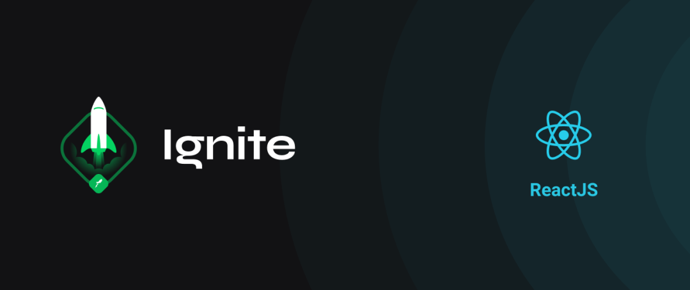

<h1 align="center">
  
  Bootcamp Ignite - ReactJS 🚀
</h1>

  Repositório direcionado a aulas, projetos e desafios do bootcamp Ignite na trilha ReactJS da Rocketseat

  

  

  

  

  

## 🚀 Sobre o Bootcamp

O Ignite é um programa de aceleração para devs, realizado pela [Rocketseat](https://rocketseat.com.br), focado em preparar profissionais completos(as) para o mercado, treinando skills técnicas e comportamentais de forma intensiva e prática.

O Ignite é dividido em trilhas de conhecimento não-dependentes onde nos aprofundamos em uma tecnologia específica. No meu caso, comecei pela trilha de ReactJS.

---

## ⚙️  Índice de aulas e desafios

Abaixo você encontra o índice de cada desafio do Ignite:

1 -  [Chapter I - Fundamentos do React](aulas/chapter-I)
  - [Desafio react concepts](desafios/challenge-react-concepts)
  - [Desafio extra](desafios/challenges-componentizando-a-aplicacao)

2 - [Chapter II - Fundamentos do React](aulas/chapter-II)

---

## 📝 Licença

Esse projeto está sob a licença MIT. Veja o arquivo [LICENSE](LICENSE) para 
mais detalhes.

 

---

Feito com 💙  por Matheus Silva