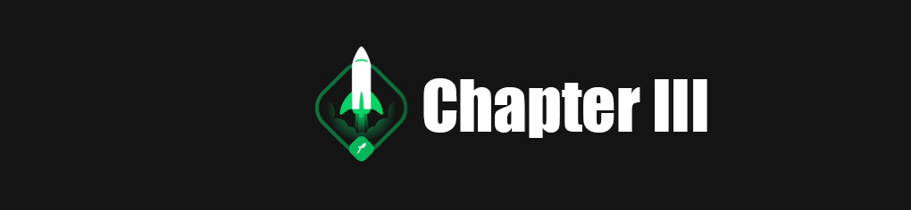

<h2 align="center">

</h2>

> Desenvolvimento do zero de um blog com NextJs, Prismic CMS, Stripe, FaunaDB, e autenticação utilizando github
 

## Conteudo

* [Fundamentos do Next.Js](fundamentos-nextJs.md)
* [Back-end no front-end](back-end-no-front-end.md)
* [Front-end JAMSTACK](front-end-jamstack.md)
