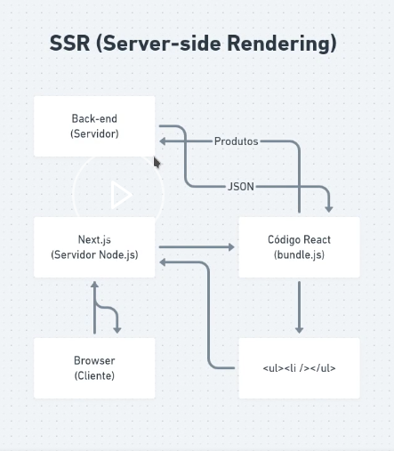

# Fundamentos do nextJS

Um framework criado em cima do react, ele foi feito para SSR(Server-Side Rendering)



# Criando uma estrutura next.js

```bash
npm create next-app ignews 
```

Dentro da pasta page o next vai considerar cada arquivo como uma rota menos  _app.js.

"File system routes"

## Adicionando Typescript

```bash
npm install typescript @types/react @types/node -d
```

Instala o typescript e a tipagem do react e do node instalando em dependencia de dev

o arquivo _app.tsx é o nosso app, toda vez que o usuario troca de tela ele é recriado do zero.

Criamos um arquivo _document.tsx, ele é carregado alguma vez  .

```js
import Document,{Html, Head, Main, NextScript} from 'next/documet'

export default class MyDocumet extends Document{
 render(){
  return(
   <Html>
   <Head>
    <link rel="preconnect" href="http://fonts.gstatc.com">
    <link href="http://fonts.googleapis.com.com/css2?family=Roboto:wght@400;700;900&display=swap" rel="stylesheet"/>"
    
    <title> ig.news <title>
   </Head>
   <body>
    <Main/>
    <NextScript/>
   </body>
   </Html> 
  )
 }
}

```

### Header dinamico

Pode ser colocado em qualquer lugar, ele insere oque esta dentro das tags no nosso header do arquivo document

```js
import Head from 'next/head';

<Head> 
 <title> Inicio/ ig.news </title>
</Head>

```
