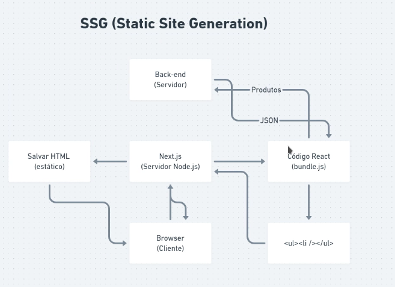

# Fundamentos do nextJS

Um framework criado em cima do react, ele foi feito para SSR(Server-Side Rendering)


# Criando uma estrutura next.js

```bash
npm create next-app ignews 
```

Dentro da pasta page o next vai considerar cada arquivo como uma rota menos  _app.js.

"File system routes"

## Adicionando Typescript

```bash
npm install typescript @types/react @types/node -d
```

Instala o typescript e a tipagem do react e do node instalando em dependencia de dev

o arquivo _app.tsx é o nosso app, toda vez que o usuario troca de tela ele é recriado do zero.

Criamos um arquivo _document.tsx, ele é carregado alguma vez  .

```js
import Document,{Html, Head, Main, NextScript} from 'next/documet'

export default class MyDocumet extends Document{
render(){
return(
  <Html>
  <Head>
  <link rel="preconnect" href="http://fonts.gstatc.com">
  <link href="http://fonts.googleapis.com.com/css2?family=Roboto:wght@400;700;900&display=swap" rel="stylesheet"/>"
  
  <title> ig.news <title>
  </Head>
  <body>
  <Main/>
  <NextScript/>
  </body>
  </Html> 
)
}
}

```

### Header dinamico

Pode ser colocado em qualquer lugar, ele insere oque esta dentro das tags no nosso header do arquivo document

```js
import Head from 'next/head';

<Head> 
<title> Inicio/ ig.news </title>
</Head>

```

## Trabalhando com o stripe

Uma plataforma de pagamento, aonde podemos fazer pagamento com cartoes de credito (visa, master), ambiente de homologação muito rapido.

Criamos um arquivo de variaveis(.env.local) de ambiente e dentro dele colocamos nossa secret key.

Podemos ter varios arquivos para cada tipo de ambiente
.env.development(verificar documentação next)

.env.local

```js
STRIPE_KEY=sk_test_51IlhqoHtkJ5nuPyTrQcPXGm7wR3Arax4eEe4sOUlXstuC9XIFoZmiDS86N6Xyq8ZMoLssdT8rV2ToWjGbf5dKi4p00d6Ef3i1D
```

Precisamos usar o stripe dentro de uma page, caso for usado em um componente ele nao vai ser processado pelo next causando uma inconcistencia na aplicação.

Dentro de uma page criamos um export para o nosso componente,  o nome sempre precisa ser 'getServerSideProps'

index.tsx

```js
import {getServerSideProps} from 'next';
import {stripe} from '../services/stripe';

interface HomeProps {
  product:{
    priceId:string;
    amount:number;
  }
}
//Pelas props pegamos nosso product e declaramos uma interface. 
export default function Home({product}: HomeProps){
  ...
  <h1>{product.amount}</h1>
  //Passamos nosso preço para algum componente
  <NossoComponent priceId={produce.amount}/>

}

export const getServerSideProps:getServerSideProps =  async() =>{
  //Chamamos nossa api do srtipe passando o key do product 
  const price = await stripe.prices.retrive('price_1IlhuDHtkJ5nuPyTh7EgTvds')

  //Criamos um obj com o preço do produto, e em seguida formatamos para dolar
  const product = {
    priceId: price.id,
    amount: new Intl.NumberFormat('en-Us'{
      style:'currency',
      currency:'USD' 
    }).format(price.unit_amount / 100),  
  }
  //retornamos nossa props 
   return (
    props:{
      product,
    }
  )
}
```

Precisamos instalar o stripe

```bash
npm install stripe 
```

Criamos uma pasta 'services' e dentro um arquivo 'stripe.ts', esse stripe é uma sdk(software developer kit)

```js
import Stripe from 'stripe';
import {version} from '../../package.json';

export const stripe = new Stripe(
process.env.STRIPE_API_KEY,
{
  apiVersion: '2020-08-27',
  appInfo:{
    name: 'nome da aplicaçao',
    version
  }
}
)
```

---

# SSG(Static Site Generation)



Paginas que o conteudo vai ser igual para todos.

No lugar do next retornar para o cliente, ele vai salvar o html como um arquivo estatico, na proxima vez que alguem for acessar a mesma tela ele vai chamar o nosso html.

Para aplicar apenas precisamos trocar nossa chamada de 'GetServerSideProps' para 'GetStaticProps'

e importamos o GetStaticProps.

```js
  import {GetStaticProps} from 'next';
```

Quando usamos o getStaticProps, temos o revalidate, nele podemos definir quanto tempo o conteudo vai ser gerado novamente, nesse caso  a cada 24 horas

```js
return (
    props:{
      product,
    },
    revalidate: 60*60*24// 24 horas 
  )
```

Temos 3 formas de fazer uma chamada API

* Client-Side: Quando nao precisamos de indexação, informação quando é carregada por uma ação do usuario.
  
* Server-Side: Utilizar quando precisamos da indexação porem precisamos de informações do contexto.
  
* Static-Side: Conseguiomos compartilhar a mesma informação com todos.

Exemplo:

Um blog
Pagina de apresentação, ela vai ser alterada poucas vezes logo podemos usar um SSG e definir quando vai ser alterada.

Post (SSG) Os posts vao acontecer semanalmente logo podemos prever que todos usuarios dentro de uma semana vao ver a mesma coisa

Comentarios Usuario vai ver depois que toda pagin for carregada logo usamos  (Client-Side)
