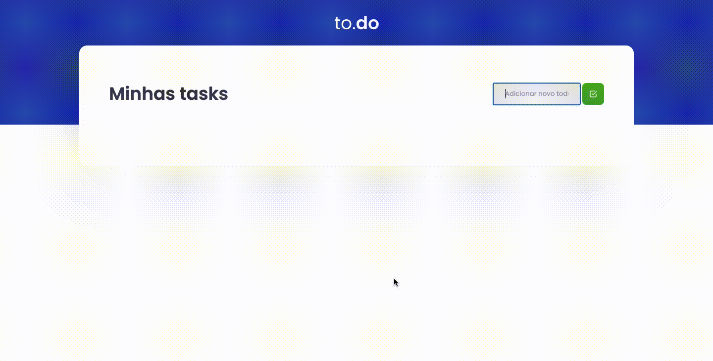

---

## 💡 Sobre
O objetivo foi criar um TO-do list. Conseguimos utilizar oque foi aprendido nas aulas, componentização, hooks, webpack entre outros.

---
## 🛠 Tecnologias

Utilizei as seguintes ferramentes: 
- **[React](https://reactjs.org/)**
- **[TypeScript](https://www.typescriptlang.org/)**
- **[Babel](https://babeljs.io/)**
- **[Webpack](https://webpack.js.org/)**
- **[Sass](https://sass-lang.com/)**
---
## 🧑‍💻 Instalação 

Para executar este projeto, você deve possuir o Node e o Yarn instalado para configurar todas as dependências.

```bash
# Clone o repositório:
$ git clone https://github.com/silvaMatheus/challenges-react-concepts

# Instale as dependências:
$ npm install

# Execute a aplicação dentro da pasta "challenges-react-concepts"
$ npm run dev

# Abra seu navegado em:
http://localhost:8080/
```
